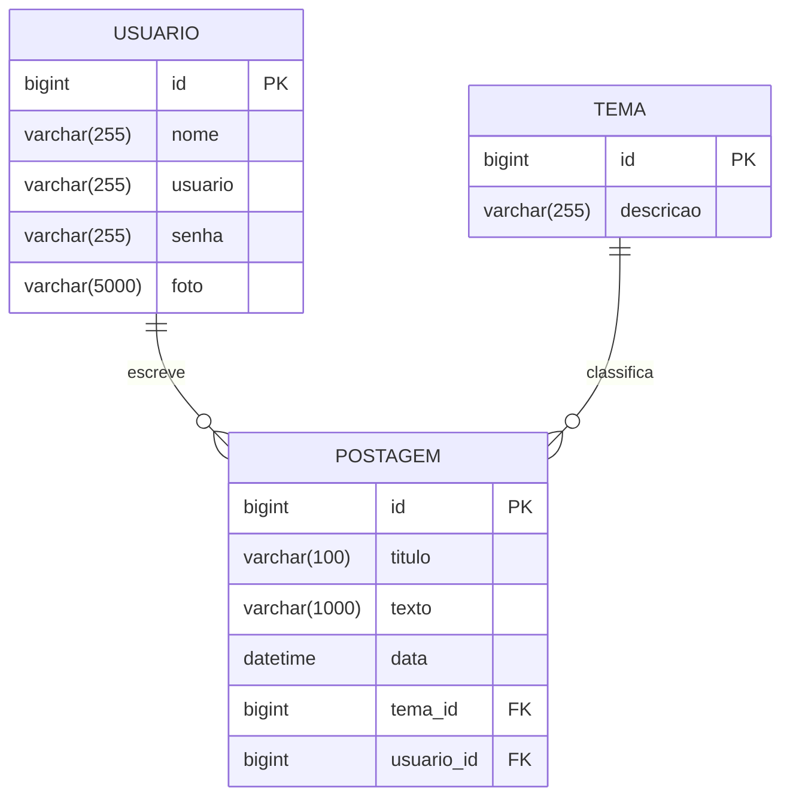

# Especificação de Escopo: Aplicação Blog Pessoal

## 1. Visão Geral do Produto

O **Blog Pessoal** é uma plataforma web para publicação de artigos e gerenciamento de conteúdos organizados por temas[cite: 2, 3]. A solução é dividida em um backend em API REST Java/Spring Boot e uma interface SPA responsiva construída em React com TypeScript.

---

## 2. Partes Interessadas (Stakeholders)

- **Visitante / Leitor:** Acessa conteúdos públicos sem necessidade de autenticação.
- **Autor / Usuário Cadastrado:** Realiza autenticação no sistema para criar e gerenciar seus próprios textos e temas.
- **Time de Engenharia de Software:** Responsável pelo desenvolvimento, manutenção da API REST[cite: 3] e versionamento dos artefatos técnicos no GitHub.

---

## 3. Modelo de Dados / Entidades (DER)

A aplicação baseia-se em três entidades fundamentais: **USUARIO**, **POSTAGEM** e **TEMA**.

